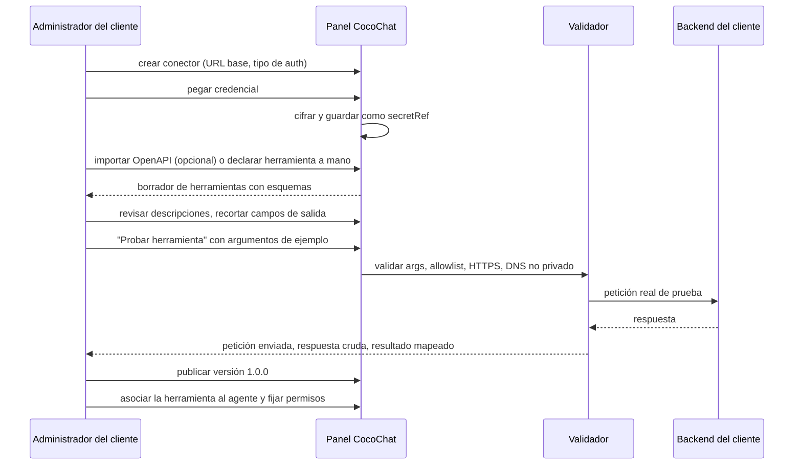

# Contrato de conectores y herramientas (propuesta conceptual)

> Estado: `PROPUESTO`. Los JSON de este documento son **propuestas para
> discutir**, no una especificación cerrada ni una implementación.
> Decisión de partida: [ADR-0004](../architecture/architecture-decisions/ADR-0004-motor-de-conectores.md).

## 1. Las cuatro cosas que no hay que mezclar

El error más frecuente al diseñar esto es meterlo todo en un mismo objeto de
"configuración del agente". Se separan deliberadamente:

| Concepto | Qué es | Quién lo ve | Dónde vive |
|---|---|---|---|
| **Metadatos de la herramienta** | Nombre, descripción y esquema de parámetros | **El modelo** | `tool_definitions` |
| **Configuración del conector** | Host, ruta, método, mapeos, timeouts | Nadie fuera de CocoChat | `connectors` |
| **Credencial** | API key, cliente OAuth… | Nadie; se descifra al ejecutar | `connector_credentials` (cifrada) |
| **Parámetros y resultado de ejecución** | Los datos concretos de una llamada | El modelo (resultado mapeado) | `execution_logs` |

El modelo **nunca** ve la URL, el método ni la credencial. Solo ve una función
con nombre, descripción y esquema. Esto no es cosmético: si el modelo conociera
la URL, una inyección de prompt podría intentar redirigirla.

## 2. Metadatos de la herramienta (lo que ve el modelo)

```jsonc
{
  "name": "consultar_disponibilidad",
  "version": "1.2.0",
  "description": "Devuelve los horarios libres de un servicio en una fecha concreta. Usar cuando el usuario pregunte por disponibilidad, huecos u horarios.",
  "parameters": {
    "type": "object",
    "properties": {
      "fecha":     { "type": "string", "format": "date", "description": "Día a consultar (YYYY-MM-DD)" },
      "servicioId":{ "type": "string", "description": "Identificador del servicio" },
      "duracion":  { "type": "integer", "minimum": 15, "maximum": 240, "default": 30 }
    },
    "required": ["fecha", "servicioId"],
    "additionalProperties": false
  },
  "returns": {
    "type": "object",
    "properties": {
      "slots": {
        "type": "array",
        "items": {
          "type": "object",
          "properties": {
            "inicio": { "type": "string", "format": "date-time" },
            "fin":    { "type": "string", "format": "date-time" }
          }
        }
      }
    }
  },
  "sideEffects": "none",
  "idempotent": true
}
```

Notas de diseño:

- `additionalProperties: false` no es opcional. Sin él, el modelo puede
  inventar campos que acaben inyectados en la petición saliente.
- `returns` sirve para dos cosas: validar lo que devuelve el cliente y,
  sobre todo, **definir la allowlist de salida** — lo que no está declarado no
  llega al modelo.
- `sideEffects` (`none` | `write` | `destructive`) e `idempotent` gobiernan
  reintentos y necesidad de confirmación humana.
- La **descripción es parte del contrato de seguridad**, no solo de usabilidad:
  es lo que hace que el modelo elija bien o mal.

## 3. Configuración del conector (interno de CocoChat)

```jsonc
{
  "id": "conn_01H...",
  "organizationId": "org_01H...",
  "name": "Backend Peluquería Supply",
  "type": "http",
  "baseUrl": "https://api.supply.example.com",
  "allowlist": {
    "hosts": ["api.supply.example.com"],
    "pathPrefixes": ["/v1/appointments", "/v1/services"],
    "followRedirects": false,
    "allowPrivateNetworks": false
  },
  "auth": { "kind": "api_key_header", "header": "X-Api-Key", "secretRef": "sec_01H..." },
  "limits": { "timeoutMs": 8000, "maxResponseBytes": 262144, "maxCallsPerTurn": 3, "maxCallsPerMinute": 60 },
  "health": { "path": "/v1/health", "intervalSeconds": 300 }
}
```

Y el binding entre la herramienta y el conector, que es donde vive la
traducción:

```jsonc
{
  "toolDefinitionId": "tool_01H...",
  "connectorId": "conn_01H...",
  "request": {
    "method": "GET",
    "path": "/v1/appointments/available",
    "query":   { "date": "{{ params.fecha }}", "service": "{{ params.servicioId }}", "minutes": "{{ params.duracion }}" },
    "headers": { "Accept": "application/json" },
    "body": null
  },
  "response": {
    "successStatus": [200],
    "map": { "slots": "$.data.available_slots[*].{inicio: start_at, fin: end_at}" },
    "redact": ["$.data..customer_email", "$.data..phone"]
  },
  "errors": {
    "404": { "code": "not_found",   "message": "No se encontró el servicio indicado" },
    "422": { "code": "invalid_args","message": "El backend rechazó los parámetros" }
  }
}
```

Decisiones abiertas aquí (`PENDIENTE-VALIDAR`): qué lenguaje de plantillas y de
mapeo se adopta (JSONPath, JMESPath, `jq`), y si se permite alguna
transformación más allá de renombrar y seleccionar campos. **Recomendación:
empezar con el subconjunto más pobre posible** —selección y renombrado, sin
expresiones arbitrarias— porque cada capacidad añadida es una superficie de
ejecución de código aportado por el cliente.

## 4. Resultado de la ejecución (sobre uniforme)

Éxito:

```jsonc
{
  "ok": true,
  "tool": "consultar_disponibilidad",
  "version": "1.2.0",
  "executionId": "exec_01H...",
  "durationMs": 312,
  "data": { "slots": [{ "inicio": "2026-01-10T09:00:00Z", "fin": "2026-01-10T09:30:00Z" }] }
}
```

Error:

```jsonc
{
  "ok": false,
  "tool": "consultar_disponibilidad",
  "executionId": "exec_01H...",
  "error": {
    "code": "upstream_timeout",
    "message": "El sistema consultado no respondió a tiempo",
    "retryable": true
  }
}
```

**Taxonomía de errores** (estable, independiente del backend del cliente):

| `code` | Cuándo | ¿Se reintenta? | Qué ve el usuario final |
|---|---|---|---|
| `invalid_args` | Los argumentos del modelo no cumplen el esquema | Sí, el **modelo** corrige (máx. 2) | Nada; se resuelve internamente |
| `not_authorized` | La herramienta no está asociada al agente | No | "No puedo hacer eso" |
| `destination_blocked` | URL fuera de la allowlist | No (error de configuración) | "No puedo consultarlo ahora" |
| `credential_error` | 401/403 del backend del cliente | No | "No puedo consultarlo ahora" + aviso al administrador |
| `upstream_timeout` | Sin respuesta a tiempo | Sí si `idempotent` | "No puedo consultarlo ahora" |
| `upstream_error` | 5xx del cliente | Sí si `idempotent` | Igual |
| `invalid_response` | La respuesta no cumple `returns` | No | Igual |
| `quota_exceeded` | Límite del plan o de llamadas por turno | No | "He alcanzado el límite" |

Regla no negociable: **si la herramienta falla, el agente no inventa el dato**.
Las instrucciones del sistema deben obligar a declarar la indisponibilidad.

## 5. Registro de una integración (flujo propuesto)



El paso de **probar antes de publicar** es lo que evita que el agente descubra
en producción que el mapeo estaba mal.

## 6. Versionado y compatibilidad

- Las definiciones de herramienta se versionan con **semver**, y un agente se
  asocia a una versión concreta o a un rango de parches (`~1.2.0`).
- **Cambio mayor** (obligatorio subir mayor): quitar un parámetro, hacer
  obligatorio uno opcional, cambiar un tipo, quitar un campo de `returns`,
  cambiar `sideEffects`.
- **Cambio menor**: añadir un parámetro opcional, añadir un campo a `returns`.
- **Parche**: mejorar la descripción o corregir un mapeo sin cambiar la forma.
- Publicar una versión **no** actualiza los agentes automáticamente: requiere
  una acción explícita. Este es exactamente el riesgo de "rug pull" que hace
  que el descubrimiento dinámico de MCP necesite aprobación manual.
- Se conserva un histórico de versiones publicadas, porque un `ExecutionLog`
  tiene que poder explicarse con el contrato vigente en su momento.
- Un *health check* periódico marca el conector como degradado y avisa al
  administrador antes de que lo descubra un usuario final.

## 7. Control de acceso en la ejecución

Tres comprobaciones, en este orden, antes de tocar la red:

1. **¿La herramienta está asociada a este agente y publicada?** Si no,
   `not_authorized`. Denegar por defecto.
2. **¿El agente puede usarla en este contexto?** Restricciones propuestas:
   por canal (widget público vs. panel interno), por rol del usuario final si
   existe, y por `sideEffects` (las de escritura pueden exigir confirmación).
3. **¿El destino resuelto está en la allowlist y no apunta a red privada?**
   Comprobado tras resolver DNS y sin seguir redirecciones.

Y después de ejecutar: registro obligatorio en `ExecutionLog` con
`organization_id`, `agent_id`, `conversation_id`, herramienta, versión,
argumentos (con campos sensibles redactados), código de resultado y duración.
Los argumentos se guardan porque sin ellos el registro no sirve para auditar;
por eso la redacción debe ser declarativa y obligatoria en campos marcados.

## 8. Alternativa: contrato fijo implementado por el cliente

Para la fase 2 (clientes con lógica compleja), el cliente implementa dos
endpoints en su backend en lugar de declarar mapeos:

```
GET  /cocochat/tools            → manifiesto de herramientas (los metadatos de §2)
POST /cocochat/tools/:name      → { "arguments": {...}, "context": {...} }
                                → el sobre de resultado de §4
```

CocoChat firma cada petición (`X-CocoChat-Signature`: HMAC del cuerpo + marca
de tiempo) para que el cliente verifique el origen y descarte reenvíos. Las
operaciones de escritura llevan `Idempotency-Key`, y el cliente se compromete a
devolver el mismo resultado ante la misma clave.

Ventaja: CocoChat deja de interpretar mapeos. Coste: el cliente escribe código.
Ambos mecanismos conviven porque el agente solo conoce `Tool`.
