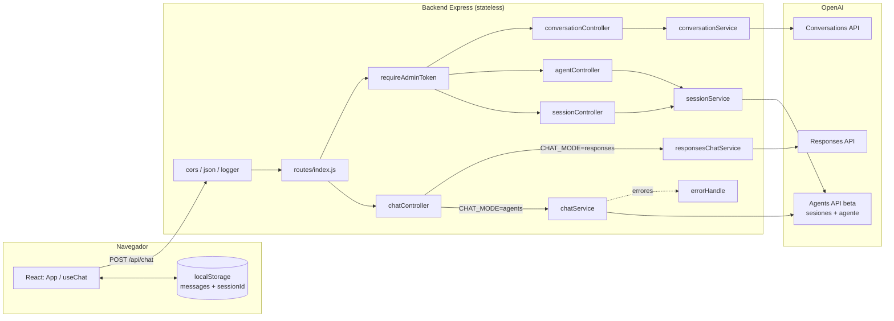
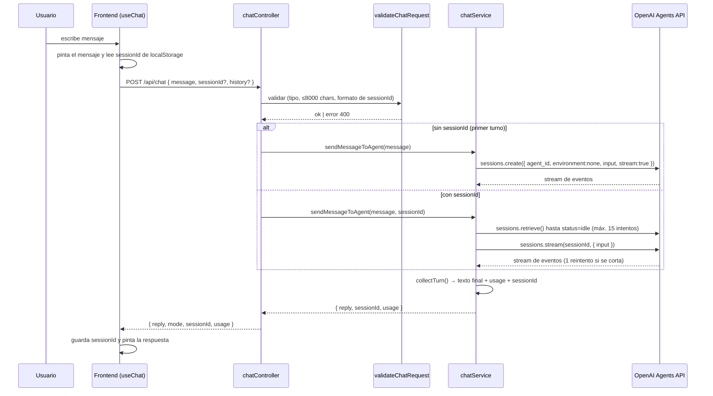
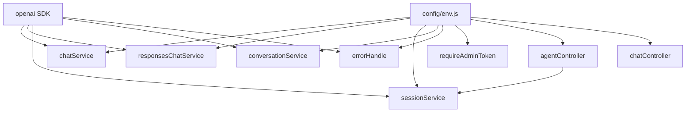

# Estado actual de la arquitectura

> Análisis del commit `f1e97af`, único commit del repositorio.
> Ningún enunciado de este documento es una suposición: cada afirmación
> apunta al archivo que la respalda.

## 1. Resumen ejecutivo

CocoChat **hoy no es una plataforma**: es una **aplicación de chat de un solo
agente y un solo inquilino**, compuesta por un backend Express que actúa como
proxy autenticado hacia la API de OpenAI y un frontend React que lo consume.

Los hechos que definen el alcance actual:

- **No hay base de datos.** No existe ORM, migraciones, ni ninguna dependencia
  de persistencia. Las únicas dependencias del backend son `express`, `cors` y
  `openai` (`backend/package.json`).
- **No hay usuarios ni tenants.** No existe entidad de usuario, sesión de
  usuario, login ni organización. El único control de acceso es un token
  estático compartido en la cabecera `x-admin-token`
  (`backend/src/middleware/requireAdminToken.js`).
- **Hay un solo agente, definido por variable de entorno.** `OPENAI_AGENT_ID`
  se fija en `.env` y es global al proceso (`backend/src/config/env.js`). No
  se pueden crear agentes desde el producto: las rutas de `/api/agents` son de
  *mantenimiento* (listar, leer, borrar), no de creación.
- **El agente no tiene conectores.** No existe ejecución de herramientas del
  lado de CocoChat. Si el agente usa tools, están configuradas en la
  plataforma de OpenAI, fuera de este repositorio.
- **El estado conversacional vive fuera.** La memoria está en la sesión de
  OpenAI (`sess_…`) y el frontend guarda el `sessionId` en `localStorage`
  (`frontend/src/hooks/useChat.js`). El backend es completamente *stateless*.
- **No hay tests.** No hay runner, ni dependencia de testing, ni archivos de
  prueba. Tampoco hay CI.

La distancia entre esto y la visión ("plataforma multi-tenant de agentes con
conectores configurables al backend del cliente") es grande, pero la base es
**sana y reutilizable**: la separación en capas está bien hecha y el punto de
extensión principal (una única capa que habla con OpenAI) está correctamente
aislado.

## 2. Inventario de lo que existe

### 2.1 Backend (`backend/`)

| Capa | Archivos | Responsabilidad real |
|---|---|---|
| Entrada | `src/server.js`, `src/app.js` | Arranque y montaje de middlewares. |
| Configuración | `src/config/env.js` | Único punto de lectura de `process.env`; valida obligatorias al arrancar. |
| Rutas | `src/routes/*.js` | Mapeo verbo → controller, y aplicación del guard de admin. |
| Controllers | `src/controllers/*.js` | Validan entrada, delegan, formatean respuesta. |
| Servicios | `src/services/*.js` | Único lugar que habla con el SDK de OpenAI. |
| Middleware | `src/middleware/*.js` | Logger, manejador de errores, guard de token. |
| Utilidades | `src/utils/**` | `ApiError`, `asyncHandler`, validadores por recurso. |

**Endpoints existentes** (`src/routes/index.js`):

| Método y ruta | Protegido | Estado |
|---|---|---|
| `GET /api/health` | No | `IMPLEMENTADO` |
| `POST /api/chat` | **No** | `IMPLEMENTADO` |
| `GET /api/sessions` | `x-admin-token` | `IMPLEMENTADO` |
| `POST /api/sessions/cleanup` (+`?dryRun`) | `x-admin-token` | `IMPLEMENTADO` |
| `POST /api/sessions/:id/cancel` | `x-admin-token` | `IMPLEMENTADO` |
| `DELETE /api/sessions/:id` | `x-admin-token` | `IMPLEMENTADO` |
| `GET /api/agents`, `GET /api/agents/:id`, `DELETE /api/agents/:id` | `x-admin-token` | `IMPLEMENTADO` |
| `POST/GET/DELETE /api/conversations…` | `x-admin-token` | `IMPLEMENTADO` |

Obsérvese que **el endpoint que cuesta dinero (`POST /api/chat`) es el único
público y sin límite de peticiones**. Ver [Problemas](#5-problemas-y-riesgos).

### 2.2 Frontend (`frontend/`)

React 19 + Vite. Una sola vista de chat: `App.jsx` orquesta
`MessageList`/`ChatInput`, `hooks/useChat.js` mantiene el estado y
`services/chatApi.js` es la única capa con `fetch`. Persiste
`{ messages, sessionId }` en `localStorage` bajo la clave
`cocochat:conversation`.

**No existe frontend administrativo**: no hay pantallas de login, de gestión de
agentes, de conectores ni de organización. Las rutas de mantenimiento del
backend solo se consumen hoy con Postman
(`backend/postman/cocoChat.postman_collection.json`).

### 2.3 Los dos modos de chat

`CHAT_MODE` selecciona en tiempo de arranque entre dos servicios con la misma
firma (`src/controllers/chatController.js`):

| Modo | Servicio | Memoria | Knowledge |
|---|---|---|---|
| `agents` (por defecto) | `chatService.js` → Agents API (beta) | Sesión en OpenAI | Sí, del agente |
| `responses` | `responsesChatService.js` → Responses API | El cliente reenvía `history` | No; solo `fallbackInstructions.txt` |

Esta dualidad es una **mitigación explícita de riesgo de proveedor**: la Agents
API está en beta y sus sesiones se atascan en `in_progress`. El código lo
documenta y lo compensa con `waitForIdle()`, un reintento y un módulo entero de
limpieza de sesiones (`sessionService.cleanupSessions`). Es una señal clara de
cuánto pesa hoy la dependencia del proveedor.

## 3. Patrón arquitectónico: qué es y qué no

**Es una Layered Architecture (MVC de servidor), no Clean ni Hexagonal.**
Evidencia, no etiqueta:

- La dirección de dependencias va **hacia fuera**: `chatService.js` importa
  `OpenAI` y `env` directamente; no hay puerto ni interfaz que invierta esa
  dependencia. En Hexagonal, el dominio no conocería al proveedor.
- **No hay capa de dominio**: no existen entidades, agregados ni objetos de
  valor. Los "objetos de negocio" son literales JSON construidos en los
  servicios.
- **No hay casos de uso separados**: los controllers hacen validación +
  orquestación; el servicio hace la llamada externa. Dos capas, no cuatro.
- **No hay repositorios** porque no hay persistencia propia.

Es decir: es el patrón **adecuado para lo que el sistema hace hoy** (un proxy
delgado hacia una API externa). Imponerle Clean Architecture ahora sería
ceremonia sin beneficio. Lo que sí justifica invertir dependencias es la parte
nueva —conectores y ejecución de herramientas—, porque ahí sí habrá reglas de
negocio propias y múltiples implementaciones. Ver
[ADR-0003](architecture-decisions/ADR-0003-estilo-arquitectonico.md).

### Diagrama de componentes actual

### Flujo actual de una consulta al agente

Puntos que este flujo deja a la vista:

1. **No hay identidad en ningún paso.** Nada distingue a un usuario de otro; la
   única "identidad" es el `sessionId` que el propio cliente aporta.
2. **El `sessionId` no se verifica contra un propietario.** Se valida el
   *formato* (`/^[A-Za-z0-9_-]{1,128}$/`), no la *pertenencia*. Cualquiera que
   conozca o adivine un `sessionId` puede continuar esa conversación.
3. **No hay punto de extensión para ejecutar una herramienta del cliente.** El
   bucle `collectTurn()` descarta explícitamente los eventos de llamada a
   tools (`default: break`). Ahí es exactamente donde encajaría el motor de
   conectores.

## 4. Dependencias y acoplamientos

- **`env.js` es un singleton global** del que dependen controllers, servicios y
  middleware. Es el mayor freno para el multi-tenant: la configuración que hoy
  es *del proceso* (`agentId`, `apiKey`, `chatMode`) tiene que pasar a ser
  *del tenant*, y eso toca todos esos archivos.
- **Cuatro servicios instancian su propio cliente OpenAI** con la misma lógica
  `getClient()` duplicada. Duplicación menor hoy; obstáculo mañana, cuando la
  credencial dependa del tenant.
- **`errorHandle` conoce el SDK de OpenAI** (`instanceof APIError`) y lee
  `env.openai.agentId` para distinguir un 404 de recurso de un 404 de
  configuración. Es pragmático y está bien razonado, pero acopla el borde HTTP
  al proveedor.
- **`agentController` importa de `sessionService`**, no de un `agentService`.
  Fronteras de módulo difusas: agentes y sesiones comparten archivo.

## 5. Problemas y riesgos

Ordenados por severidad, con la evidencia.

### Seguridad

| # | Riesgo | Evidencia | Severidad |
|---|---|---|---|
| S1 | `POST /api/chat` es **público y sin rate limiting ni cuota**. Cada llamada gasta tokens de OpenAI facturados al dueño de la key. Un tercero que descubra la URL puede consumir el presupuesto. | `chatRoutes.js` no monta ningún guard; no hay dependencia de rate limiting. | **Alta** |
| S2 | `cors()` sin opciones = `Access-Control-Allow-Origin: *`. Cualquier web puede llamar al backend desde el navegador de sus visitantes. | `app.js` línea `app.use(cors())`. | **Alta** |
| S3 | Un `sessionId` ajeno permite leer y continuar la conversación de otro. No hay comprobación de propiedad. | `chatValidation.js` valida forma, no pertenencia. | **Alta** |
| S4 | Autorización = **un único token estático compartido**, sin usuarios, roles, expiración ni rotación. Comparado con `!==`, susceptible a ataque de temporización (menor). | `requireAdminToken.js`. | Media |
| S5 | `DELETE /api/agents/:id` permite destruir un agente y su knowledge de forma irreversible con solo el token de admin. Está mitigado (confirmación en el body, protección del agente en uso), pero el radio de daño de ese único token es total. | `agentController.removeAgent`. | Media |
| S6 | Sin límite de tamaño de cuerpo explícito y `express.json()` por defecto (100 kb); el tope real de negocio (8000 chars) solo aplica a `message`, no a `history` × 50 mensajes. | `app.js`, `chatValidation.js`. | Baja |
| S7 | El logger imprime método, URL e IP de cada petición, sin correlación ni redacción. No es un log de auditoría y no sirve para trazar quién hizo qué. | `logger.js`. | Baja |

Nota positiva: el manejo de errores **sí** evita filtrar detalles del proveedor
al cliente y oculta el stack cuando el error viene del SDK
(`errorHandle.js`). Está bien resuelto.

### Arquitectura y producto

| # | Riesgo | Impacto |
|---|---|---|
| A1 | **Configuración global por proceso**: un despliegue = un agente = un cliente. El modelo comercial exige lo contrario. Es el bloqueante nº 1. | **Alta** |
| A2 | **Sin persistencia propia**: no se puede facturar por uso, auditar, mostrar histórico ni saber qué hizo un agente. Todo el estado es de OpenAI o del `localStorage` del usuario. | **Alta** |
| A3 | **Dependencia total de una API en beta**: el propio código convive con sesiones atascadas, esperas a `idle` y reintentos. Si la Agents API cambia, el producto se detiene. | **Alta** |
| A4 | **Sin tests ni CI**: cualquier refactor hacia multi-tenant se haría a ciegas sobre comportamiento no cubierto. | **Alta** |
| A5 | **Sin observabilidad**: no hay métricas, trazas, ni coste por tenant/agente. Imposible operar un SaaS así. | Media |
| A6 | Frontend acoplado a "una conversación global" en `localStorage`: no hay concepto de usuario ni de varios hilos. | Media |
| A7 | Fronteras de módulo difusas (agentes dentro de `sessionService`). | Baja |

## 6. Puntos de extensión aprovechables

Lo que **no** hay que tirar:

1. **`chatService` como única frontera con el proveedor.** Convertirlo en un
   puerto (`AgentRuntime`) con implementaciones `OpenAIAgentsRuntime` /
   `OpenAIResponsesRuntime` es un cambio pequeño y de alto valor: mitiga A3 y
   abre la puerta a otros proveedores.
2. **El patrón de doble modo ya demuestra que la sustitución funciona.** El
   controller no sabe con qué API habla. Es, de hecho, una inversión de
   dependencias incipiente hecha a mano.
3. **`env.js` como único lector de configuración.** Para introducir
   configuración por tenant basta con cambiar un módulo y sus consumidores, en
   vez de perseguir `process.env` por todo el código.
4. **`ApiError` + `errorHandle` + `asyncHandler`**: contrato de error uniforme
   ya resuelto; sirve tal cual para los errores de conectores.
5. **`utils/validations/`**: patrón de validación explícita y por recurso que
   se extiende naturalmente a los esquemas de parámetros de herramientas.
6. **El hueco del `default: break` en `collectTurn()`**: el lugar natural donde
   enganchar el bucle de *tool calling* hacia el backend del cliente.

## 7. Funcionalidades existentes (inventario funcional)

| Funcionalidad | Estado |
|---|---|
| Conversar con un agente único con memoria del lado de OpenAI | `IMPLEMENTADO` |
| Modo de respaldo con Responses API e historial del cliente | `IMPLEMENTADO` |
| Persistencia de la conversación en el navegador | `IMPLEMENTADO` |
| Reporte de consumo de tokens por turno (`usage`) | `IMPLEMENTADO` (solo se devuelve, no se guarda) |
| Mantenimiento de sesiones: listar, cancelar, borrar, limpieza | `IMPLEMENTADO` |
| Mantenimiento de agentes: listar, leer, borrar | `IMPLEMENTADO` |
| Mantenimiento de conversaciones de OpenAI | `IMPLEMENTADO` |
| Manejo uniforme de errores y traducción de errores de OpenAI | `IMPLEMENTADO` |
| Protección de rutas de mantenimiento con token estático | `PARCIAL` (no es autenticación) |
| Registro de usuarios, login, sesiones de usuario | **No existe** |
| Organizaciones / tenants / aislamiento | **No existe** |
| Creación y configuración de agentes desde el producto | **No existe** |
| Conectores a backends de clientes | **No existe** |
| Ejecución de herramientas (tool calling) del lado de CocoChat | **No existe** |
| Persistencia, auditoría, métricas de uso | **No existe** |
| Frontend administrativo | **No existe** |
| Tests, CI, despliegue | **No existe** |

## 8. Preguntas abiertas de esta fase

Ver el listado completo y priorizado en [`../open-questions.md`](../open-questions.md).
Las tres que condicionan todo lo demás:

1. ¿Quién paga los tokens: CocoChat con su key, o cada cliente con la suya?
   Determina el modelo de costes, el aislamiento y hasta el esquema de datos.
2. ¿Modelo A (SaaS gestionado) o Modelo B (backend entregado al cliente)?
   Determina si hace falta multi-tenancy real o basta con una instancia por
   cliente.
3. ¿El agente solo debe **consultar** información, o también **ejecutar
   acciones** (crear reservas, pedidos)? Escribir cambia radicalmente el
   diseño de permisos, idempotencia y auditoría.
