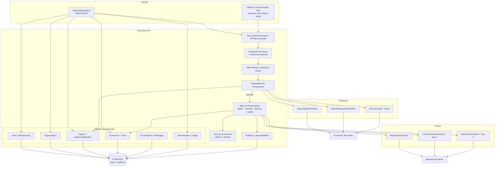
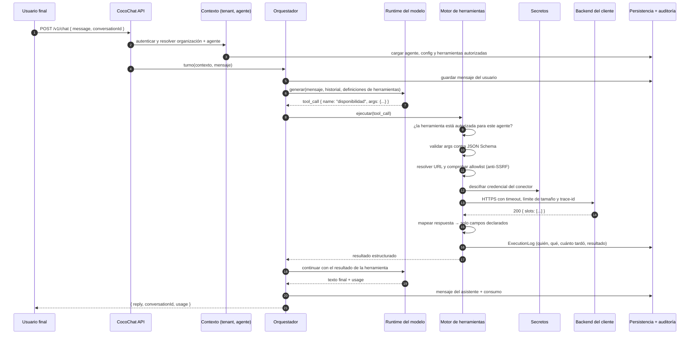

# Arquitectura objetivo (propuesta)

> Estado: `PROPUESTO` / `PENDIENTE-VALIDAR`.
> Este documento describe el destino, **no el MVP**. En cada sección se marca
> qué entra en el MVP y qué es posterior. El plan por etapas está en
> [`../product/roadmap.md`](../product/roadmap.md).
> No implementar nada de aquí sin validar antes las preguntas de
> [`../open-questions.md`](../open-questions.md).

## 1. Principios de diseño

1. **Multi-tenant desde el modelo de datos, no como parche.** Cada fila que
   pertenece a un cliente lleva `organization_id`, y el acceso pasa siempre por
   un contexto de tenant resuelto en el borde. Retro-encajar esto después es
   una migración de datos y una auditoría de seguridad completa.
2. **El agente habla con herramientas, no con conectores.** `Tool` es el
   contrato estable hacia el modelo; el transporte (HTTP, MCP, contrato fijo)
   es intercambiable.
3. **Denegar por defecto.** Un agente solo puede usar las herramientas que se
   le han asociado explícitamente, y un conector solo puede llamar a los
   destinos de su allowlist.
4. **Los secretos nunca están en la configuración.** La configuración
   referencia un secreto por id; el valor vive cifrado y solo se descifra en
   el momento de ejecutar.
5. **Todo lo que gasta dinero o cambia datos ajenos se registra.** Ejecución
   de herramienta y consumo de tokens son eventos de auditoría, no logs.
6. **Se invierten las dependencias solo donde hay varias implementaciones
   reales**: runtime de modelo y driver de conector. En el resto se mantiene
   el estilo por capas actual, que funciona. Ver
   [ADR-0003](architecture-decisions/ADR-0003-estilo-arquitectonico.md).

## 2. Componentes

### Fronteras de módulo

| Módulo | Responsabilidad | MVP |
|---|---|---|
| `identity` | Usuarios, credenciales, sesiones, memberships | Sí (mínimo) |
| `organizations` | Tenant, plan, cuotas | Sí |
| `agents` | Agente y su configuración; asociación de herramientas | Sí |
| `connectors` | Conector, credencial, definición de herramientas, versionado | Sí (HTTP, lectura) |
| `tool-execution` | Validar argumentos, autorizar, ejecutar, mapear salida, auditar | Sí |
| `conversations` | Conversación, mensajes, trazabilidad | Sí (persistencia mínima) |
| `runtime` | Adaptador al proveedor de modelo | Sí (extraer el actual) |
| `secrets` | Cifrado, referencia, rotación | Sí |
| `observability` | Auditoría, métricas, coste por tenant | Parcial |
| `knowledge` | Fuentes documentales propias (RAG) | **No** — hoy lo cubre el agente de OpenAI |

Regla de dependencias: `tool-execution` **no** conoce `agents` ni
`conversations`; recibe un contexto ya resuelto (tenant, agente, herramientas
autorizadas). Así puede extraerse a un servicio aparte sin rediseño.

## 3. Flujo objetivo de una consulta con herramienta

Diferencias esenciales con el flujo actual
([current-state](current-state.md#flujo-actual-de-una-consulta-al-agente)):
hay identidad en el paso 2, el agente se resuelve por datos y no por
`.env`, existe un paso 8-15 que hoy no tiene equivalente, y cada paso que
cuesta dinero o toca un sistema ajeno deja rastro.

### Manejo de errores en el turno

| Situación | Comportamiento propuesto |
|---|---|
| Argumentos inválidos contra el esquema | No se llama al backend. Se devuelve el error **al modelo** para que reintente con argumentos corregidos (máx. 2 veces). |
| Destino fuera de la allowlist | Error de configuración, no se reintenta. Se avisa al administrador del tenant. |
| Timeout del backend del cliente | Resultado `unavailable` al modelo, que responde "no puedo consultarlo ahora". Nunca se inventa el dato. |
| 5xx del cliente en operación idempotente | Un reintento con *backoff*; luego `unavailable`. |
| 5xx en operación no idempotente | **Sin reintento**. Se registra y se informa. |
| Presupuesto de herramientas agotado en el turno | Se corta el bucle (máx. N llamadas por turno) y se responde con lo obtenido. |

## 4. Multi-tenancy

Propuesta: **una base de datos, un esquema, `organization_id` en toda tabla de
negocio**, con aislamiento reforzado en dos niveles:

1. **Aplicación**: el repositorio recibe el contexto de tenant y no expone
   métodos sin filtro. Ningún servicio construye consultas sin él.
2. **Base de datos**: Row Level Security de PostgreSQL con el
   `organization_id` fijado por sesión de conexión, como red de seguridad ante
   un error de aplicación.

Alternativas descartadas para el MVP, con motivo: *esquema por tenant* (coste
de migraciones × N), *base por tenant* (coste operativo y de conexiones sin
demanda que lo justifique). Ambas siguen siendo opción para un plan
"dedicado" de empresa. Ver
[ADR-0002](architecture-decisions/ADR-0002-multi-tenancy.md).

## 5. Persistencia

**PostgreSQL** como única base del MVP: relaciones claras, JSONB para
esquemas de herramientas y configuraciones, RLS para aislamiento y madurez
operativa. Detalle de entidades en [`../data/data-model.md`](../data/data-model.md).

No se propone Redis, cola de mensajes ni vector store en el MVP: no hay
volumen que lo justifique y cada pieza añadida es coste operativo. Se anotan
como disparadores explícitos: caché/rate-limit distribuido cuando haya más de
una instancia; cola cuando aparezcan operaciones largas o asíncronas; vector
store solo si CocoChat asume el knowledge propio (hoy lo cubre OpenAI).

## 6. Observabilidad

Tres planos, que no hay que confundir:

- **Logs** (operación): estructurados en JSON, con `request_id`,
  `organization_id`, `agent_id`. Nunca cuerpos completos de conversaciones ni
  credenciales.
- **Auditoría** (cumplimiento): `ExecutionLog` y `AuditLog` en base de datos,
  consultables por el cliente en su panel. Responden "¿qué hizo el agente en
  mi sistema y por orden de quién?".
- **Métricas** (producto y coste): tokens y coste por organización, agente y
  conversación; latencia y tasa de error por conector. Sin esto no se puede
  facturar por uso ni detectar un conector roto.

## 7. Escalabilidad

El backend se mantiene **sin estado**, así que escala horizontalmente. Los
puntos de presión reales, por orden de aparición:

1. **Concurrencia contra el proveedor de modelo** (hoy ya se nota: sesiones
   atascadas). Mitigación: límite de concurrencia por organización y cola con
   rechazo explícito antes que degradación silenciosa.
2. **Llamadas salientes a backends de clientes**: un cliente lento puede
   agotar el pool. Mitigación: timeouts agresivos, *circuit breaker* por
   conector y aislamiento del ejecutor.
3. **Base de datos**: los logs de ejecución crecen rápido. Mitigación:
   particionado por fecha y política de retención declarada por plan.

## 8. Qué se conserva del código actual

- La estructura de capas de `backend/src` y su convención de nombres.
- `ApiError`, `asyncHandler`, `errorHandle` y el catálogo de códigos HTTP.
- El patrón de validación explícita de `utils/validations/`.
- Los dos modos de chat, promovidos de `if` a implementaciones del puerto
  `AgentRuntime`.
- Las rutas de mantenimiento de sesiones y agentes, que pasan a ser
  operaciones internas de soporte, protegidas por rol y no por token global.

## 9. Qué requiere rediseño

| Pieza actual | Por qué | Destino |
|---|---|---|
| `config/env.js` como origen de `agentId`/`apiKey` | Es configuración de proceso; debe ser de tenant | Configuración por organización en base de datos; `env` solo para infraestructura |
| `requireAdminToken` | No es autenticación ni tiene granularidad | Autenticación de usuario + API keys por organización + roles |
| `cors()` abierto y `/api/chat` público | Riesgos S1 y S2 de current-state | Allowlist de orígenes por tenant, autenticación del canal y cuotas |
| Agentes dentro de `sessionService` | Fronteras difusas | Módulos `agents` y `runtime` separados |
| Estado solo en `localStorage` | No hay histórico ni auditoría | Conversaciones y mensajes persistidos, con el cliente como propietario del dato |
