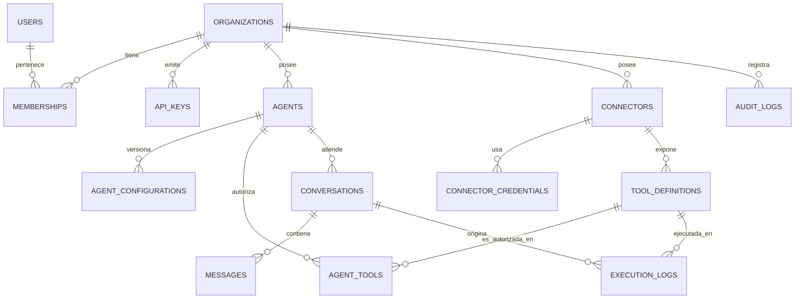

# Modelo de datos

> Estado: **actual = ninguno**; el resto es `PROPUESTO`.
> No se generan migraciones hasta que este modelo se valide
> ([ADR-0005](../architecture/architecture-decisions/ADR-0005-persistencia-y-runtime.md)).

## 1. Modelo de datos actual

**CocoChat no tiene base de datos.** No hay ORM, ni migraciones, ni esquema.
El estado vive en tres sitios ajenos al backend:

| Dato | Dónde vive | Consecuencia |
|---|---|---|
| Configuración del agente (instructions, knowledge, tools, modelo) | OpenAI, referenciado por `OPENAI_AGENT_ID` | CocoChat no puede crear ni versionar agentes |
| Memoria de la conversación | Sesión de OpenAI (`sess_…`) | No hay histórico propio ni auditoría |
| Mensajes mostrados y `sessionId` | `localStorage` del navegador | Se pierde al limpiar el navegador; no hay continuidad entre dispositivos |
| Consumo de tokens | Se devuelve por turno y se descarta | No se puede facturar por uso |

## 2. Entidades propuestas

Clasificación explícita de qué entra en el MVP. **No se crean todas**: cada
tabla es coste de migración, de mantenimiento y de superficie de seguridad.

| Entidad | ¿Existe hoy? | MVP | Motivo |
|---|---|---|---|
| `organizations` | No | **Sí** | Unidad de aislamiento, cuota y facturación |
| `users` | No | **Sí** | No hay producto sin quien entre al panel |
| `memberships` | No | **Sí** | Relación usuario↔organización con rol |
| `api_keys` | No | **Sí** | El backend del cliente tiene que autenticarse |
| `agents` | No (solo un id en `.env`) | **Sí** | Núcleo del producto |
| `agent_configurations` | No | **Sí**, como versión de `agents` | Permite historial y *rollback* de instrucciones |
| `connectors` | No | **Sí** | Núcleo de la integración |
| `connector_credentials` | No | **Sí** | Secretos cifrados, separados de la configuración |
| `tool_definitions` | No | **Sí** | Lo que ve el modelo, versionado |
| `agent_tools` | No | **Sí** | Autorización explícita agente↔herramienta |
| `conversations` | No (están en OpenAI) | **Sí**, mínima | Sin esto no hay histórico ni auditoría |
| `messages` | No | **Sí**, mínima | Idem |
| `execution_logs` | No | **Sí** | Obligatorio: registra llamadas al sistema del cliente |
| `audit_logs` | No | Parcial | Solo eventos sensibles en el MVP |
| `usage_records` | No | **No** | Derivable de mensajes y ejecuciones hasta que haya facturación por uso |
| `knowledge_sources` | No | **No** | Hoy el knowledge lo aporta el agente de OpenAI |
| `plans` / `subscriptions` | No | **No** | Un campo `plan` en la organización basta al principio |

## 3. Diagrama entidad-relación propuesto (MVP)

## 4. Detalle por entidad

Todas las tablas de negocio llevan `organization_id NOT NULL`, claves foráneas
compuestas `(organization_id, id)` y RLS
([ADR-0002](../architecture/architecture-decisions/ADR-0002-multi-tenancy.md)).
Se omite repetirlo en cada ficha.

### `organizations`
- **Propósito**: el tenant. Unidad de aislamiento, cuota y facturación.
- **Atributos**: `id`, `name`, `slug` (único), `plan`, `status`,
  `settings` (JSONB: runtime preferido, límites), `created_at`.
- **Índices**: único en `slug`.
- **Riesgo**: `settings` como JSONB puede convertirse en un cajón de sastre;
  promover a columna lo que se consulte o valide.

### `users`
- **Propósito**: persona con acceso al panel.
- **Atributos**: `id`, `email` (único global), `password_hash`, `name`,
  `mfa_secret` (cifrado), `last_login_at`.
- **Nota**: **no** lleva `organization_id`: un usuario puede pertenecer a
  varias organizaciones. Es la única excepción a la regla.
- **Riesgo**: dato personal; sujeto a borrado por petición.

### `memberships`
- **Propósito**: relación usuario↔organización con rol.
- **Atributos**: `id`, `organization_id`, `user_id`, `role`, `invited_by`,
  `accepted_at`.
- **Restricción**: único `(organization_id, user_id)`; al menos un `owner` por
  organización (regla de aplicación, comprobada al eliminar).

### `api_keys`
- **Propósito**: autenticación servidor a servidor del backend del cliente.
- **Atributos**: `id`, `organization_id`, `name`, `prefix` (visible),
  `key_hash`, `scopes`, `last_used_at`, `expires_at`, `revoked_at`.
- **Regla**: el valor se muestra una sola vez; se guarda *hasheado*.

### `agents`
- **Propósito**: agente configurable del cliente.
- **Atributos**: `id`, `organization_id`, `name`, `description`, `status`
  (`draft`/`published`/`archived`), `active_configuration_id`,
  `external_agent_ref` (p. ej. `agent_…` de OpenAI, si el runtime lo usa).
- **Índices**: `(organization_id, status)`.

### `agent_configurations`
- **Propósito**: versión inmutable de la configuración de un agente
  (instrucciones, modelo, parámetros, runtime). Permite historial y *rollback*,
  y explicar por qué el agente respondió como respondió hace un mes.
- **Atributos**: `id`, `organization_id`, `agent_id`, `version`,
  `instructions`, `model`, `params` (JSONB: temperatura, tope de tokens),
  `runtime` (`openai_agents`/`openai_responses`), `published_at`, `created_by`.
- **Riesgo**: las instrucciones pueden contener conocimiento sensible del
  negocio; cifrado en reposo y acceso por rol.

### `connectors`
- **Propósito**: definición de la conexión al backend del cliente.
- **Atributos**: `id`, `organization_id`, `name`, `type` (`http`/`contract`/
  `mcp`), `base_url`, `allowlist` (JSONB), `limits` (JSONB), `status`,
  `health_status`, `last_health_check_at`.
- **Restricción**: `base_url` debe ser HTTPS y pasar la validación de destino.

### `connector_credentials`
- **Propósito**: material secreto, **separado** de la configuración.
- **Atributos**: `id`, `organization_id`, `connector_id`, `kind`
  (`api_key_header`/`bearer`/`oauth2_cc`), `ciphertext`, `key_version`,
  `expires_at`, `rotated_at`.
- **Reglas**: nunca se devuelve por la API; nunca se registra en logs;
  descifrado solo en ejecución. Clave derivada por organización.

### `tool_definitions`
- **Propósito**: lo que el modelo ve y puede invocar; versionado.
- **Atributos**: `id`, `organization_id`, `connector_id`, `name`, `version`,
  `description`, `parameters_schema` (JSONB), `returns_schema` (JSONB),
  `binding` (JSONB: método, ruta, mapeos, redacción), `side_effects`,
  `idempotent`, `status` (`draft`/`published`/`deprecated`).
- **Restricción**: único `(organization_id, name, version)`; el `name` debe
  ser un identificador válido para el proveedor de modelo.
- **Índices**: `(organization_id, connector_id, status)`.

### `agent_tools`
- **Propósito**: autorización explícita. Sin fila, no hay permiso.
- **Atributos**: `id`, `organization_id`, `agent_id`, `tool_definition_id`,
  `version_constraint`, `enabled`, `requires_confirmation`.
- **Restricción**: único `(agent_id, tool_definition_id)`.

### `conversations`
- **Propósito**: hilo de conversación, propiedad del cliente.
- **Atributos**: `id`, `organization_id`, `agent_id`, `channel`,
  `end_user_ref` (identificador **opaco** que aporta el cliente, no un dato
  personal), `external_session_ref`, `status`, `started_at`, `last_message_at`.
- **Índices**: `(organization_id, agent_id, last_message_at DESC)`.
- **Riesgo**: `end_user_ref` no debe usarse para meter correos o teléfonos.

### `messages`
- **Propósito**: turnos de la conversación.
- **Atributos**: `id`, `organization_id`, `conversation_id`, `role`,
  `content`, `tool_calls` (JSONB), `token_usage` (JSONB), `created_at`.
- **Riesgo**: contienen datos personales de usuarios finales. Retención
  configurable y borrado efectivo.
- **Índices**: `(conversation_id, created_at)`; particionado por fecha si
  crece.

### `execution_logs`
- **Propósito**: **la entidad de confianza del producto.** Registra cada
  llamada al sistema del cliente.
- **Atributos**: `id`, `organization_id`, `conversation_id`, `agent_id`,
  `tool_definition_id`, `tool_version`, `request_id`, `arguments` (JSONB, con
  campos declarados redactados), `status`, `error_code`, `http_status`,
  `duration_ms`, `created_at`.
- **Índices**: `(organization_id, created_at DESC)`,
  `(tool_definition_id, status)`.
- **Riesgo**: es la tabla que más crece y la que más datos sensibles puede
  acumular. Particionado por fecha y retención por plan desde el primer día.

### `audit_logs`
- **Propósito**: quién hizo qué en la plataforma (crear conector, rotar
  credencial, publicar herramienta, invitar usuario).
- **Atributos**: `id`, `organization_id`, `actor_type`, `actor_id`, `action`,
  `resource_type`, `resource_id`, `metadata` (JSONB), `ip`, `created_at`.
- **Regla**: solo se añade; nunca se actualiza ni se borra dentro del periodo
  de retención.

## 5. Reglas de integridad transversales

1. Toda FK entre tablas de negocio es compuesta con `organization_id`.
2. No se borra físicamente nada que tenga registros de ejecución asociados:
   borrado lógico (`archived_at`) para conservar la explicabilidad de la
   auditoría.
3. Un `agent_tool` solo puede apuntar a una `tool_definition` publicada de la
   misma organización.
4. Una `tool_definition` con `side_effects != none` exige
   `requires_confirmation = true` mientras no exista el flujo de confirmación.
5. Las credenciales no tienen `SELECT` disponible desde la API en ningún rol.

## 6. Qué no se modela todavía y por qué

- **Facturación y suscripciones**: hasta que no se decida quién paga los
  tokens ([`../open-questions.md`](../open-questions.md)), modelar precios es
  especular.
- **Knowledge propio / RAG**: hoy lo cubre el agente de OpenAI. Traerlo a
  CocoChat implica *embeddings*, almacén vectorial e ingesta: un producto
  dentro del producto.
- **Canales** (WhatsApp, web, Slack): se anota `channel` en la conversación,
  pero no se modela la integración hasta que haya demanda.
