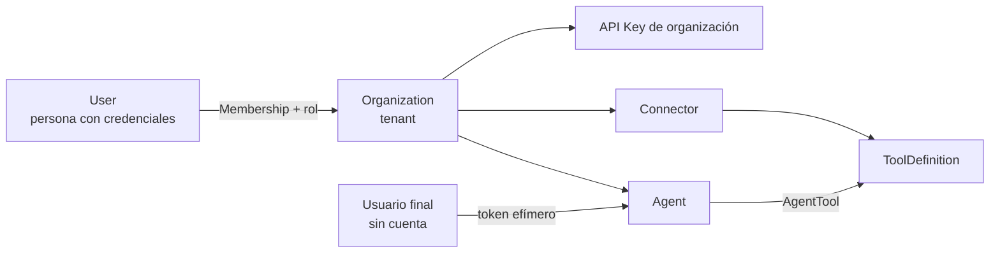

# Modelo de seguridad y multi-tenancy

> Secciones marcadas `ACTUAL` (verificado en el código) y `PROPUESTO`.
> Este documento es el que decide si CocoChat es vendible a una empresa:
> se le pide una credencial de acceso a su backend de producción.

## 1. Situación actual `ACTUAL`

| Aspecto | Estado hoy |
|---|---|
| Autenticación de usuarios | **No existe**. No hay usuarios. |
| Autorización | Un único token estático compartido en `x-admin-token` (`backend/src/middleware/requireAdminToken.js`). Todo o nada. |
| Aislamiento entre clientes | **No existe**. Un despliegue = un cliente. |
| `POST /api/chat` | **Público, sin autenticación ni límite de peticiones.** Cada llamada gasta tokens facturados al dueño de la key. |
| CORS | `cors()` sin opciones → cualquier origen. |
| Propiedad de la conversación | No se comprueba: quien conozca un `sessionId` puede continuar esa conversación. |
| Secretos | `OPENAI_API_KEY` en `.env`, fuera de git, nunca expuesta al frontend. **Bien resuelto.** |
| Fuga de información en errores | Mitigada: los errores del SDK se traducen y nunca se devuelve su stack (`errorHandle.js`). **Bien resuelto.** |
| Auditoría | No existe. El logger imprime método, URL e IP, sin correlación ni actor. |
| Cifrado en reposo | No aplica: no hay datos propios. |

Riesgos priorizados en
[`../architecture/current-state.md`](../architecture/current-state.md#5-problemas-y-riesgos)
(S1-S7). Los tres primeros —chat público sin cuota, CORS abierto y `sessionId`
sin propietario— deberían cerrarse **aunque no se haga nada más**, porque hoy
ya tienen coste económico real.

## 2. Modelo de identidad propuesto `PROPUESTO`

Cuatro identidades distintas, que hoy no se distinguen:

1. **Usuario de la plataforma**: persona con cuenta, pertenece a una o varias
   organizaciones con un rol en cada una.
2. **Organización (tenant)**: propietaria de agentes, conectores, secretos y
   conversaciones. Unidad de facturación, cuota y aislamiento.
3. **Servicio del cliente**: el backend del cliente llamando a CocoChat con
   una API key de organización.
4. **Usuario final**: quien conversa con el agente. Normalmente sin cuenta en
   CocoChat; se le emite un token efímero acotado a un agente, un origen y un
   tiempo.

### Autenticación

- Contraseñas con Argon2id (o bcrypt con coste alto); nunca algoritmos
  rápidos.
- Sesión por *token* de corta vida + *refresh* rotatorio, o cookie `HttpOnly`,
  `Secure`, `SameSite=Lax`. Si se usan cookies, protección CSRF obligatoria.
- MFA (TOTP) al menos para el rol `owner`. Requisito frecuente en compras
  empresariales.
- SSO/OIDC como capacidad de plan superior, no en el MVP.
- API keys de organización: se muestran **una sola vez**, se guardan
  *hasheadas*, llevan prefijo identificable (`ck_live_`), fecha de último uso
  y se pueden revocar y rotar con solapamiento.

### Autorización: roles propuestos

| Rol | Agentes | Conectores | Credenciales | Miembros | Facturación | Logs |
|---|---|---|---|---|---|---|
| `owner` | CRUD | CRUD | CRUD | CRUD | Sí | Todos |
| `admin` | CRUD | CRUD | CRUD | Invitar | No | Todos |
| `developer` | CRUD | CRUD | **Solo referenciar, no leer** | No | No | Propios |
| `operator` | Leer y publicar | Leer | No | No | No | Todos |
| `viewer` | Leer | Leer | No | No | No | Leer |

Dos reglas que importan más que la tabla:

- **Nadie, en ningún rol, puede leer el valor de una credencial ya guardada.**
  Se puede sustituir, no recuperar.
- Los permisos se comprueban **por recurso y tenant** (`¿este agente pertenece
  a mi organización?`), no solo por rol. La confusión de estas dos cosas es el
  origen habitual de los IDOR.

## 3. Aislamiento entre tenants `PROPUESTO`

Cuatro capas, según [ADR-0002](../architecture/architecture-decisions/ADR-0002-multi-tenancy.md):

1. **Borde**: el contexto de tenant se resuelve al autenticar y viaja
   explícito; nunca se toma de un parámetro que envía el cliente.
2. **Aplicación**: la capa de datos no expone métodos sin filtro de tenant.
3. **Base de datos**: `organization_id NOT NULL` en toda tabla de negocio,
   claves foráneas compuestas `(organization_id, id)` y Row Level Security.
4. **Criptografía**: clave de cifrado de secretos derivada por organización,
   para que un volcado de tabla no comprometa a todos los clientes a la vez.

Pruebas obligatorias: por cada recurso expuesto, un test "el tenant A recibe
404 al pedir un recurso del tenant B". Sin esa batería, no se incorpora un
segundo cliente.

## 4. Gestión de secretos `PROPUESTO`

> **Actualizado 2026-09.** Con la decisión de BYOK
> ([ADR-0006](../architecture/architecture-decisions/ADR-0006-modelo-de-producto-y-costes.md)),
> CocoChat custodia **dos** tipos de secreto ajeno: las credenciales de los
> conectores y las **claves de OpenAI de sus clientes**, que son claves de
> facturación. Una filtración de las segundas se traduce en gasto directo
> para el cliente, así que reciben el mismo trato: cifradas, sin lectura
> desde la API, fuera de los logs, descifradas solo en ejecución y con
> rotación soportada. La forma concreta de almacenamiento es la P12 de
> [`../open-questions.md`](../open-questions.md), la última decisión
> bloqueante pendiente.

- Cifrado con AEAD (AES-256-GCM o XChaCha20-Poly1305) y clave maestra en un
  KMS o gestor de secretos; en base de datos solo el material cifrado.
- La configuración **referencia** el secreto por id (`secretRef`). Un secreto
  jamás aparece en un objeto de configuración de agente, ni en un log, ni en
  una respuesta de la API. Para esto existe la separación en cuatro capas de
  [`../api/integrations.md`](../api/integrations.md#1-las-cuatro-cosas-que-no-hay-que-mezclar).
- Descifrado solo en el instante de ejecutar y en memoria.
- Rotación: dos versiones activas a la vez para rotar sin corte; caducidad
  configurable y aviso previo.
- OAuth 2.0 *client credentials* con refresco automático y almacenamiento del
  token de acceso en caché por debajo de su expiración.
- Redacción automática en logs por patrón conocido, **además** de los campos
  declarados por el cliente.

## 5. Seguridad de las llamadas salientes `PROPUESTO`

El punto más peligroso del producto: CocoChat hará peticiones HTTP a URLs que
aporta un tercero. Sin controles, eso es un servicio de SSRF.

| Control | Detalle |
|---|---|
| Solo HTTPS | Sin excepciones en producción; validación de certificado activada. |
| Allowlist de host y prefijo de ruta | Declarados por conector y aprobados al publicarlo. |
| Resolución DNS verificada | Rechazar IP privadas, *loopback*, *link-local* (169.254.0.0/16, incluida la metadata de nube) y ULA IPv6. Comprobar **después** de resolver, para evitar *DNS rebinding*; idealmente conectar a la IP ya validada. |
| Sin redirecciones | Desactivadas por defecto; si se habilitan, revalidar cada salto. |
| Timeouts | Conexión y total, cortos (5-10 s). Un cliente lento no puede agotar el pool. |
| Límite de tamaño | Respuesta acotada (p. ej. 256 KB) y `Content-Type` verificado. |
| Límite de llamadas | Por turno, por conversación y por minuto y organización. |
| *Circuit breaker* | Por conector, con marca de degradado y aviso al administrador. |
| Egreso restringido | Cuando el ejecutor se aísle, política de red que solo permita los destinos de la allowlist. |
| Sin credenciales tras redirección | Nunca reenviar cabeceras de autorización a otro host. |

## 6. Amenazas específicas de agentes de IA `PROPUESTO`

Estas no se resuelven con controles HTTP y conviene ser honestos sobre su
estado del arte:

| Amenaza | Mitigación propuesta | ¿Suficiente? |
|---|---|---|
| **Prompt injection** desde el mensaje del usuario o desde los datos que devuelve el backend | Conjunto mínimo de herramientas por agente; ninguna de escritura en el MVP; confirmación humana para escritura; auditoría completa | **No del todo.** No existe solución completa conocida; se reduce el impacto, no la probabilidad |
| **Exfiltración de datos** del cliente a través de la conversación | Allowlist de campos de salida (`returns`), reglas de redacción, prohibición de pasar respuestas crudas al modelo | Razonable |
| **Uso excesivo / coste** (agente en bucle llamando herramientas) | Máximo de llamadas por turno, presupuesto de tokens por organización, alertas | Sí |
| **Envenenamiento del contrato** (una versión nueva de herramienta cambia el comportamiento) | Versionado semver, publicación explícita, sin actualización automática | Sí |
| **Alucinación presentada como dato del cliente** | Regla de sistema: si la herramienta falla, declarar indisponibilidad; marcar en la respuesta qué vino de una herramienta | Parcial |

## 7. Privacidad y cumplimiento `PENDIENTE-VALIDAR`

Al persistir conversaciones, CocoChat pasa a tratar datos personales de los
usuarios finales del cliente. Requisitos que hay que resolver **antes** de
vender, no después:

- Rol de **encargado del tratamiento** y contrato correspondiente con cada
  cliente; el cliente es el responsable.
- Política de retención configurable y borrado efectivo a petición.
- Registro de subencargados (el proveedor del modelo es uno).
- Residencia de datos: qué región, y si algún cliente la exigirá.
- Si el proveedor del modelo entrena o no con los datos enviados.
- Cifrado en reposo y en tránsito, y copias de seguridad cifradas.

Preguntas concretas pendientes en [`../open-questions.md`](../open-questions.md).

## 8. Plan mínimo de endurecimiento inmediato

Aplicable **hoy**, sin esperar a la plataforma, y de bajo coste:

1. Restringir CORS a los orígenes propios (cierra S2).
2. Proteger `POST /api/chat` con un límite por IP y un tope diario de gasto
   (mitiga S1).
3. Reducir el límite de tamaño del cuerpo en `express.json()` (S6).
4. Comparar el token de administración en tiempo constante (S4).
5. Añadir `requestId` a los logs para poder correlacionar (S7).

No cierra S3 (propiedad del `sessionId`), que requiere identidad y por tanto
entra en la Fase 1.
